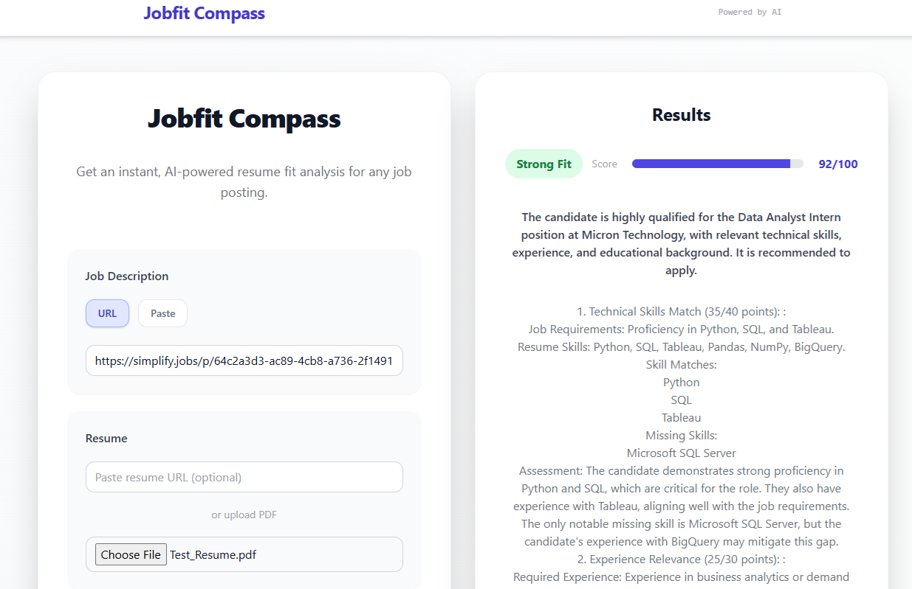

## Example Output


# Resume Jobfit Compass

An AI-powered application that analyzes how well your resume matches a job posting and provides detailed feedback and improvement suggestions.

## Prerequisites

- Node.js 18.0 or later
- npm or yarn package manager
- OpenAI API key

## Features

- **Job Analysis**: Paste job URLs or job descriptions directly
- **Resume Upload**: Support for PDF uploads or resume URLs
- **Comprehensive Analysis**: 5-section detailed breakdown:
  - Technical Skills Match (40 points)
  - Experience Relevance (30 points) 
  - Industry/Domain Knowledge (15 points)
  - Educational Background (10 points)
  - Soft Skills/Culture Fit (5 points)
- **Actionable Improvements**: Specific suggestions for enhancing your application
- **Match Scoring**: 0-100 compatibility score

## Setup

1. Clone the repository:
```bash
git clone <your-repo-url>
cd resume_application
```

2. Install dependencies:
```bash
npm install
```

3. Set up environment variables:
```bash
cp .env.local.example .env.local
```
Add your OpenAI API key to `.env.local`:
```
OPENAI_API_KEY=your_openai_api_key_here
```

4. Run the development server:
```bash
npm run dev
```

5. Open [http://localhost:3000](http://localhost:3000) in your browser.

## Environment Variables

- `OPENAI_API_KEY` (required): Your OpenAI API key
- `OPENAI_MODEL` (optional): OpenAI model to use (default: gpt-4o-mini)
- `DEBUG` (optional): Enable debug logging (default: false)

## Usage

1. Enter a job posting URL or paste the job description
2. Upload a PDF resume or provide a resume URL
3. Click "Analyze Job Fit" to get your detailed analysis
4. Review the comprehensive breakdown and improvement suggestions

## Tech Stack

- **Runtime**: Node.js
- **Frontend**: Next.js 14, React, TypeScript, Tailwind CSS
- **Backend**: Next.js API Routes
- **AI**: OpenAI GPT-4o-mini
- **PDF Processing**: pdf-parse
- **Deployment**: Vercel-ready configuration

## Deployment

This application is configured for seamless deployment to cloud platforms:

### Vercel Deployment
The project includes Vercel-optimized configuration:
- Environment variable management
- Automatic builds and deployments
- Production-ready Next.js setup
- Zero-config deployment pipeline

To deploy:
1. Push your code to GitHub
2. Connect your repository to Vercel
3. Configure environment variables
4. Deploy with one click

## Contributing

1. Fork the repository
2. Create a feature branch
3. Make your changes
4. Submit a pull request


